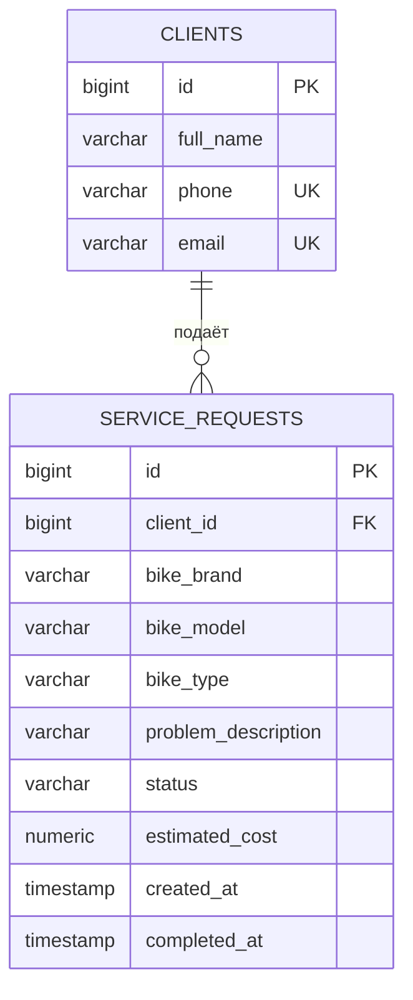

# Структура базы данных

Один клиент может иметь много заявок. Каждая заявка принадлежит одному клиенту.

`ON DELETE RESTRICT` запрещает удалять клиента с заявками. `CHECK` ограничивает статусы, типы, стоимость и дату завершения. `UNIQUE` исключает повтор телефона и email. Email может быть NULL; телефон обязателен.
